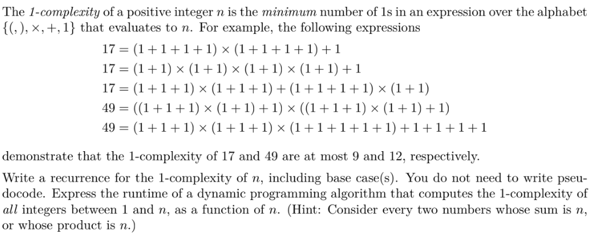

# 1-complexity problem calculation
This project intends to find if another recurrence exist for 1-complexity problem.
Which is defined as following:

This project intends to verify that is the following is a valid recurrence:  
dp[n+1] = [for all i 1 to n:   
min(dp[i]+dp[j] where i*j=(n+1), dp[n]+1)]

The calculation process will be monitored by a web-based system